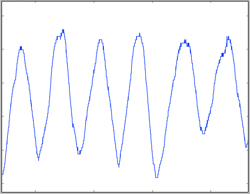
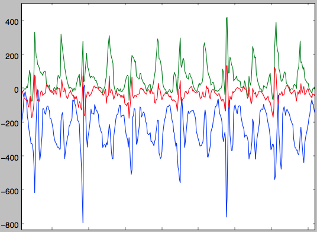
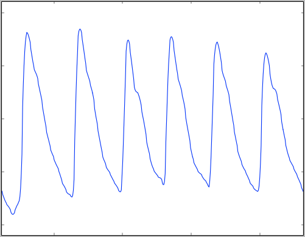

# Introduction

```
  _    _                    _    _
 | |  | |                  | |  (_)
 | |__| | _____  _____  ___| | ___ _ __  
 |  __  |/ _ \ \/ / _ \/ __| |/ / | '_ \
 | |  | |  __/>  < (_) \__ \   <| | | | |
 |_|  |_|\___/_/\_\___/|___/_|\_\_|_| |_|

This column will contain helpful example queries and responses, along with additional information to help you understand how the REST API works.
```

This is the **Hexoskin REST API** reference Wiki.

The **Hexoskin REST API** allows you to interact and manipulate your Hexoskin data through HTTP requests. This includes accessing biometrics and user information (both yours and your friends'), but also annotating data, viewing advanced reports, fetching metrics, and more. Follow along as we explore the possibilities, or if you're up to it, jump straight to the resources you want to access.

## Before getting started

### Other ways to access your Hexoskin data

If you ended up here, you are probably interested in doing a bit more with your Hexoskin biometrics. However, if you just want to download your data, there might be an easier way than using our REST API. You can download all your data in binary form directly from the [dashboard](https://my.hexoskin.com/). We provide scripts for Python and Matlab/Octave to help you covert them in .csv files, if you need. Have a look at [this page](http://support.hexoskin.com/customer/portal/articles/1491087-can-i-download-raw-data-from-the-dashboard-) and see if it's sufficient for your needs.

Additionally, there is a [Python client](https://bitbucket.org/carre/hexoskin-api-python-client) available, available on Bitbucket. If you have implemented the API in another language and want to share it, be sure to write us an e-mail at [api@hexoskin.com](mailto:api@hexoskin.com) and we'll put it up along with the Python client.

### Getting an API key

To use this REST API, you'll need an API key. If you don't have one already, email us at [api@hexoskin.com](mailto:api@hexoskin.com) with your project name and a quick description of what you want to do, and we'll happily create you one.

### So... What's a REST API?

If you're new to using APIs, you're at the right place. You'll need to understand the concept of REST API before you can do anything. Reading this will help, but you will probably have a little homework to do if you're starting from scratch. If you already know what we are talking about, great! Jump ahead to the Hexoskin REST API Overview section to get started.

For those still here, REST stands for [REpresentational State Transfer](http://en.wikipedia.org/wiki/Representational_state_transfer) and describes a way to make data accessible, generally via the Internet. A website like [http://hexoskin.com](http://hexoskin.com) is something you're most likely already comfortable with. It's a page that contains some information. To go to the developer section of the website, you can obviously click on a few button, but you can also add [/pages/developers](http://hexoskin.com/pages/developers) to the previous URL, and you'll end up in the developer section. You just went from the general website to the developer-oriented page.
A REST API works in a very similar fashion. The entry point of the REST API is `https://api.hexoskin.com/api/v1/`, and appending information at the end will bring you further down. For example, asking for `https://api.hexoskin.com/api/v1/account/` will return you your own account's information. The information is returned as a JSON object, a standard format for such kind of information.

Something quite neat about REST APIs is that you can add arguments that will modify what the REST API returns to you. For example, take `https://api.hexoskin.com/api/v1/trainingroutine/`. The response you receive will contain all training routines available to perform. But what if you want to look at the training routines that you have used? Well, looking at the trainingroutine documentation [https://api.hexoskin.com/docs/resource/trainingroutine/](https://api.hexoskin.com/docs/resource/trainingroutine/), you see that there is a filter just for that. You can then query `https://api.hexoskin.com/api/v1/trainingroutine/?using=True`, and voilà, you have used a filter to modify what the REST API returns to you.

One final thing to mention : While your web browser will allow you to fetch information from regular websites, our REST API requires additional information that the browser doesn't provide. To interact with the REST API, you need to be using some programming language that allows you to specify some headers to the HTTP request you are making. That will allow you to GET, POST information, DELETE and PATCH some resources that you want modified. This documentation provides example HTTP requests, without regard to the actual implementation in a specific programming language.

# Getting started

## Overview and Technology

The API is built using Django and Tastypie. As such, the methods of querying the API follow the implementation patterns of Tastypie.

We have attempted to conform to RESTful practices as much as is practical. There are a few instances where a judicious departure has been indulged but overall you can assume things will work RESTfully.

## HexoTimestamp

```
For example, the 25th May of 2006 12:00:00pm is represented, in UNIX timestamps, as 1414690957. That times 256 is 362160884992, which is the 25th May 2006 12:00:00 in HexoTimestamp format.
```

Timestamps are represented a little differently than is usual. Instead of representing the number of seconds since Jan 1, 1970 UTC (UNIX timestamps), they represent the number of 256ths of a second since Jan 1, 1970 12:00:00pm UTC. In other words, they are a regular timestamp multiplied by 256. All timestamps in the system are like this unless explicity noted otherwise. This modification allows the ECG's timestamps to be stored as integers, since it has the highest sampling rate, at 256Hz.

## Making Requests

All requests are conducted over SSL. Any non-SSL requests received are forwarded to HTTPS. All requests must be signed with a valid API key. All requests must be authenticated via Basic Auth or OAuth with the exception of createuserrequest.

```
By default, all responses are returned as JSON. However data resources can be returned as JSON, CSV or binaries, so you can set your headers manually. The accepted headers for data format are:

    Accept: application/json
    Accept: application/octet-stream
    Accept: text/csv
```

Currently, only JSON is supported for non-data resources. For data resources, JSON, CSV and octet-stream are supported, though JSON have limitations (see [data](#data)). Set your headers accordingly.

On the whole, interactions with the API behave as described in [Tastypie's documentation](https://django-tastypie.readthedocs.org/en/v0.9.16/interacting.html). A couple of notable restrictions are:

DELETE and PUT requests to list views are always denied.
PUT to a detail view of a non-existant instance will not attempt to create the instance, it will result in a 404.
POST requests to detail views are always denied.

> An example POST request would look something like this :

```
POST api.hexoskin.com/api/v1/range/
From: mailer@mail.com
User-Agent: HTTPTool/1.0
Content-Type: application/json
X-HEXOTIMESTAMP: 1234567890
X-HEXOAPIKEY: 3X4mP1ePu6licK3y
X-HEXOSAPISIGNATURE: 3x4mPl3ShA15igN4tUr33x4mPl3ShA15igN4tUr3
```
```json
{"name":"NewRange",
 "user":555,
 "start":369592079271,
 "end":369592079271}
```
When performing any kind of request, they have to be signed with your public API key, the timestamp, and the URL. Your API key has a public and a private portion. Never send the private key, only use it to sign the request. Send the public key.

To use the keys, you add three headers to each request:

* `X-HEXOTIMESTAMP`: a normal UTC timestamp.
* `X-HEXOAPIKEY`: your public key.
* `X-HEXOAPISIGNATURE`: the signature.

The signature is a SHA1 hash of the the private key, timestamp, and the URL (the entire URL, including the GET arguments). The order, of course, is very important. To help you remember, it's alphabetic: Key, Timestamp, Url.


## Retrieving Resources

### List views

> A typical list view, this one taken from https://api.hexoskin.com/api/v1/datatype/ looks like:

```json
{
    "meta": {
        "limit": 20,
        "next": "/api/v1/datatype/?limit=20&offset=20",
        "offset": 0,
        "previous": null,
        "total_count": 95
    },
    "objects": [
        {
            "dataid": 208,
            "hexo_freq": null,
            "info": "Recorder start annotation.",
            "name": "RECSTR_ANNOT_CHAR",
            "resource_uri": "/api/v1/datatype/208/"
        },
        {
            "dataid": 16,
            "hexo_freq": 1,
            "info": "1 to 3 leads ECG channel(s).",
            "name": "ECG_CHANNEL_CHAR",
            "resource_uri": "/api/v1/datatype/16/"
        },
        {
            "dataid":"..."
        }
    ]
}
```
To get a list of resources, you make a GET request to the resource's endpoint. For instance, to retrieve datatypes you would access the following resource:

`https://api.hexoskin.com/api/v1/datatype/`

Resources are represented as URIs. URIs generally conform to the following model:

`/api/[API version]/[resource name]/`

For example, all the datatypes are found by issuing a GET request to:

`/api/[API version]/[resource name]/[ID]/`

This is a "list view" because it will return a list of all the instances of that resource that the current user is allowed to see.

Note that the resource name is singular and there is a trailing slash. Also note that by default, a list's limit of returned objects is 20. To change that, you have to specify the `?limit=` argument in your GET query. However, it will never return more than 1000 objects.

Requests to lists return an object containing two members; meta contains information about the results and objects contains the actual results. A sample result from `/api/v1/datatype/?offset=20` is shown on the right panel.

As you can see, the meta object tells us how to page through the data. You can roll your own paging routines of course, but you may also use the next and previous attributes of the meta object. The limit and offset variables are passed in the GET to determine which page to retrieve.

### Filtering and Ordering

> https://api.hexoskin.com/api/v1/record/?device__in=HXSKIN1200001773,HXSKIN1200002049

```json
{
    "meta": {
        "limit": 20,
        "next": null,
        "offset": 0,
        "previous": null,
        "total_count": 13
    },
    "objects": [
        {
            "data": "TfzfJ1QAAABIWERFVi1BVVRPTXwAAAAAhQoAAEZGRkZGRkZGRkZGRkZGRkZGRkZGRkZGRkZGRkZGRkZGAQAFAA==",
            "data_status": {},
            "dev_id": "FFFFFFFFFFFFFFFFFFFFFFFFFFFFFFFF",
            "device": "/api/v1/device/HXSKIN1200002115/",
            "end": 361451358544,
            "firmware_rev": "1.0.5",
            "id": 43419,
            "n_uploaded_timelines": 0,
            "npages": 71710,
            "resource_uri": "/api/v1/record/43419/",
            "soft_protocole": 0,
            "soft_uid": "HXDEV-AUTO",
            "start": 361446243405,
            "start_date": "2014-09-28T10:16:28+00:00",
            "status": "complete",
            "user": {
                "email": "athlete@hexoskin.com",
                "first_name": "Athlete",
                "id": 1511,
                "last_name": "Hexoskin",
                "profile": "/api/v1/profile/1460/",
                "resource_uri": "/api/v1/user/1511/",
                "username": "athlete@hexoskin.com"
            }
        },
        {
            "data":"..."
        }
    ]
}
```

Variables for filtering and ordering the results are also passed through the GET arguments. You can filter on any combination of fields and filter types in the Filtering Options of a resource. Refer to the 'Filtering Options' section of endpoint's documentation to determine what these are for that resource. For example, records support the following filtering options:


* device: exact, in
* start: exact, range, gt, gte, lt, lte
* end: exact, range, gt, gte, lt, lte
* user: exact, in

You use a filter type by passing a GET argument of `[column]__[filtertype]=[value]`. So to view a list of records that contains only records that started on or after a startTimestamp of 347631277170, you would append `startTimestamp__gte=347631277170` to the URL like this:

`https://api.hexoskin.com/api/v1/record/?startTimestamp__gte=347631277170`

If no filtertype is specified, exact is assumed. so `user__exact=/api/v1/user/99` is the same as `user=/api/v1/user/99`.

Ordering works in a similar fashion. Columns which support ordering are listed in each endpoints' documentation under 'Sorting Options'. You may pass `order_by=` followed by a comma-separated list of columns. The sort order is ascending by default, to make the sort order descending prepend the column name with a `-`. So to add a descending order to our record query, you would make the following request:

`https://api.hexoskin.com/api/v1/record/?startTimestamp__gte=347631277170&order_by=-startTimestamp`

###Detail views

>A typical detail view, this one taken from https://api.hexoskin.com/api/v1/datatype/208/, looks like :

```json
{
    "dataid": 208,
    "freq": null,
    "info": "Recorder start annotation.",
    "name": "RECSTR_ANNOT_CHAR",
    "resource_uri": "/api/v1/datatype/208/"
}
```
You may query a specific instance of a resource by accessing its URI. You are strongly encouraged to use the resource_uri attribute that is provided with each resource, however if you prefer to create them, they generally follow the pattern of the list URI with the ID appended:

`/api/[API version]/[resource name]/[ID]/`

So to access the Recorder start annotation datatype directly, you would make a GET request to:

`https://api.hexoskin.com/api/v1/datatype/208/`

Note that the detail view does not contain a meta and object attribute, the resource instance is returned directly.


## Create, Update and Delete

> For example, a POST on annotation with the following content: {'datatype': '4096', 'start': 123456, 'user': 835, 'annotation': 'Hey guys!'} will return the following content:

```json
{
    "annotation": "Hey guys!",
    "datatype": "/api/v1/datatype/4096/",
    "id": 61353,
    "last_update": 362161472635,
    "record": null,
    "resource_uri": "/api/v1/annotation/61353/",
    "start": 123456,
    "start_date": "1970-01-01T00:08:02+00:00",
    "user": "/api/v1/user/835/"
}
```

Creating an instance of a resource is achieved by issuing a POST or a PATCH request to the list view of the desired resource. If the instance is created is successfully, you will receive a 201 with the location of the new resource in the Location header. For many resources, the instance will be in the body but sometimes, primarily in cases where there is a lot of data involved, the instance representation is omitted.

Not all resources support PATCH requests and some don't support creation at all! Please refer to the documentation for each resource to see what methods are supported and which fields must be supplied.

To update an instance, you may send a PUT or a PATCH to the URI of the resource instance you wish to update. As with creation, support for different methods vary between resources, be sure to check the docs.

If you use the PATCH method, it is not necessary to supply the entire object, you may supply only the fields you wish to change. If you use the PUT method you must provide a complete object to replace the existing one.

Deleting, as one would expect, is done by sending a DELETE request to the resource instance's URI.

## Cached Content

The API caches results to improve performance. If your are receiving a cached response, the X-HexoCache header will be present and will contain a timestamp (normal timestamp, not a HexoTimestamp) of the time it was cached.

## Error Codes

### 400 Bad Request

There is a problem with the data or the format of the data supplied.

### 401 Unauthorized

Your authentication failed.

### 403 Forbidden

Your user is not allowed to do what your are trying to do.

### 404 Not Found

The resource does not exist or you are not allowed to see the resource instance requested.

### 405 Method Not Allowed

You have attempted to use a method which is not allowed on the given resource.

### 500 Server Error

The API has encountered an error.


# Common Operations Examples

This section contains example recipes, displaying some functionalities of the REST API. However, before jumping in, there will be a quick overview of the Hexoskin ecosystem (the resources and their interactions). Read away if this is interesting to you, or jump straight to the examples.

## Hexoskin ecosystem overview

At this point, you might have some data collected or are looking at the demo account, and are wondering: What are the different building blocks of this API and how do they interact together? Is there anything important that I should know before getting into this? Before getting in the detailed filters and query descriptions, this section will give you a quick overview of the Hexoskin ecosystem.

For starters, to find all hexoskin-collected data you have to specify a timestamp range and a user. When a user connects his hexoskin to the shirt, a `Record` is created. A `Record` consists, among others, of a user, and a start and end timestamp. Because of that, when asking for data, you can either query directly by timestamp, or instead ask for a record's data directly. Since records are always created over Hexoskin-collected data, you should never find any data outside of a record. Since it comes from the mobile phone directly, all GPS data is instead aggregated in the `Ranges`. Speaking of which, `Ranges`, often referred to as activities, are a way for you to annotate what you were doing at a given time. `Ranges` have, among other attributes, a name, a start and end time, and an user. When using the mobile application, setting the activity will start the GPS data collection if applicable, and that data will be available for that `Range`.

All Hexoskin-collected data is separated in `datatype`s. Each `datatype` has it's own id, and when accessing `data`, you pass a list of `datatype` ids in the request.

Some `Ranges` will trigger additional processing, making more data available to you. Depending on the `activitytype` of the `trainingroutine` of the range applied, HRV, sleep positions, and more become available. Refer to the `activitytype` documentation to see what makes which `data` available. The relationship between `range`s, `trainingroutine`s and `activitytype`s is very simple : An activitytype is a broad category that regroups multiple `trainingroutine` together and that tells us if some special processing must be done. For example, Resting is an example of `activitytype` and tells us to process HRV. `trainingroutine` are just a specific type of activity. The `trainingroutine` indicates if the GPS should be started when using the application via the 'geo' field, but otherwise, it's just a slightly more specific categorization of the `range`. `range`s are the instance of a trainingroutine. When performing an activity and annotating it on the phone, a `range` is created, allowing the user to easily find back "that time" he did "that thing".

In the API, there is a coach-athlete and friend relationship. They differ by the kind of permissions they provide to the affected users. As someone's friend or as his coach, his data will appear in the responses, unless you filter them out. Athletes do not see the coach's data.


## Getting user profiles

> https://api.hexoskin.com/api/v1/account/

```json
{
    "meta": {
        "limit": 1,
        "next": null,
        "offset": 0,
        "previous": null,
        "total_count": 1
    },
    "objects": [
        {
            "email": "athlete@hexoskin.com",
            "first_name": "Athlete",
            "id": 1511,
            "is_staff": false,
            "last_name": "Hexoskin",
            "profile": {
                "date_of_birth": "1980-01-01",
                "fitness": {
                    "fitness_percentile": 50,
                    "height": 1.82,
                    "hr_max": 183,
                    "hr_recov": 0,
                    "hr_rest": 73,
                    "vo2_max": 42,
                    "weight": 78
                },
                "gender": "M",
                "height": 1.82,
                "id": 1460,
                "preferences": null,
                "resource_uri": "/api/v1/profile/1460/",
                "unit_system": "metric",
                "weight": 78
            },
            "resource_uri": "/api/v1/user/1511/",
            "username": "athlete@hexoskin.com"
        }
    ]
}
```

There are two ways of accessing user information. Using

`https://api.hexoskin.com/api/v1/account/`

will always return you only the authenticated user's data. However, if you have friends or athletes under your account, you can see their account information with

`https://api.hexoskin.com/api/v1/user/`

The list you receive contains summaries of all users you can see's informations. This includes the authenticated account, and any friend or athlete that user has. In this summary view, the profile is returned as an URI. To access a specific user's profile, either ask for

`https://api.hexoskin.com/api/v1/profile/[ID]`

or get the detail view of the user's data with

`https://api.hexoskin.com/api/v1/user/[userID]`

Be sure to not mix up the user's ID with his profile's ID, as they will most likely differ.


## Getting biometric data - JSON

>https://api.hexoskin.com/api/v1/data/?datatype__in=19,33&record=37700

```json
[
    {
        "data": {
            "19": [
                [
                    359840227126,
                    70
                ],
                [
                    359840227382,
                    71
                ],
                ["..."]
            ],
            "33": [
                [
                    359840227126,
                    12
                ],
                [
                    359840227382,
                    13
                ],
                ["..."]
            ]
        },
        "user": "/api/v1/user/1511/"
    }
]

```

Because Hexoskin records lots of data, all hexoskin-recorded data is neatly organized in separate datatypes that you can query individually. You can view a list of all existing datatypes by using :

`https://api.hexoskin.com/api/v1/datatype/`

Because it is returning a list view, the previous call returns a maximum of 20 objects. If you want to see a different subset, check out [List views](#list-views) for more information.

When you know which datatypes you need, you need to decide for which time frame you want them. To do so, you can pass a range or record. To get a list of records, for example, you can call :

`https://api.hexoskin.com/api/v1/record/`

Now that you know what data you want, and for which record, you can query as follow, using the IDs of the resources you want :

`https://api.hexoskin.com/api/v1/data/?datatype__in=19,33&record=37700`

The previous query will return the datatype IDs 19 and 33 (heart rate and breathing rate) for record 37700.

Note that all data is limited to return a maximum of 65535 points. If the time range you are asking for would contain more points (such as 257 seconds or more of 256Hz EKG, for example), the data returned is subsampled appropriately to return the max number of data points.

<aside class="notice">
This method is the easiest to implement (compared to the binary files approach) if you are trying to download asynchronous data.
</aside>

## Getting biometric data - Binary

> The following Python script converts your binary files data and prints it.

```python
# Decode WAV file
import struct
data = struct.Struct("h")  #Binary format : short
with file('record_37700/ECG_I.wav', 'r') as f:
    f.seek(44)  # Skip WAV headers
    bytes = f.read(data.size)
    while bytes:
        print data.unpack(bytes)
        bytes = f.read(data.size)

"""
Output for synchronous data:
    (1352,)
    (1236,)
    (1193,)
    ...
"""

#Decode asynchronous file (.hxd)
import struct
data = struct.Struct("Qq") # Binary format : Unsigned long long, long long
with file('record_37700/RR_interval.hxd', 'r') as f:
    bytes = f.read(data.size)
    while bytes:
        print data.unpack(bytes)
        bytes = f.read(data.size)

"""
Output for asynchronous data:
    (85, 256)
    (154, 69)
    (234, 80)
    ...
"""
```


If you are interested in the full, unsubsampled raw data, you might want to consider getting it using the Accept: application/octet-stream header. This will return your data in compressed zip binary format. So for example, you wanted to download the raw ECG and RR interval for a given record, you would first call

`https://api.hexoskin.com/api/v1/data/?datatype__in=4113,18&record=37700`

with the header `Accept:application/octet-stream`, which will write the output to a Zip file.

The previous call sets the Accept header to application/octet-stream to download the data in the binary format, then outputs the data to the record_37700 zip file. Datatype 4113 stands for ECG, and 18 for RR interval

The next step is to unzip the compressed file. You can call

`unzip record_37700.zip`

which will create the record_37700 directory, containing ECG_I.wav and RR_interval.hxd, our binary files.

In this case, the ECG is synchronous, while the RR interval data is asynchronous.You can use the example on the right to guide you and find the equivalent to decode both files in your favorite programming language.

As mentionned in the data resource documentation:
s
"Syncronous data is returned as a RIFF/WAV file and asynconous data is returned as a series of timestamp/value pairs encoded as long longs (8 bytes)." This means that synchronous data does not contain the timestamps. You can easily know when a sample has been acquired though, because you can access the record start and know the sampling rate. For the asynchronous data, the first column represents the offset from the record's start, in HexoTimestamp.

<aside class="notice">
Although more complex, this method is much more efficient to implement for accessing raw data. That is because the JSON method will download everything in ASCII (increasing file size compared to binary), and leave in the timestamps (effectively doubling or more the size of the file). Additionally, a maximum of 65535 data points are returned per query when accepting JSON responses. The additional paging necessary to access all the unsubsampled data would greatly reduce the download efficiency.
</aside>

## Getting GPS data

> https://api.hexoskin.com/api/v1/track/

```json
{
    "meta": {
        "limit": 20,
        "next": "/api/v1/track/?limit=20&offset=20",
        "offset": 0,
        "previous": null,
        "total_count": 10
    },
    "objects": [
        {
            "area": null,
            "distance": 656.763124754487,
            "id": 80,
            "name": "",
            "range": "/api/v1/range/58979/",
            "resource_uri": "/api/v1/track/80/",
            "source": "",
            "user": "/api/v1/user/805/"
        },
        {
            "area":"..."
        }
    ]
}
```

> https://api.hexoskin.com/api/v1/trackpoint/?track=80

```json
{
    "meta": {
        "limit": 20,
        "next": "/api/v1/trackpoint/?track=80&limit=20&offset=20",
        "offset": 0,
        "previous": null,
        "total_count": 53
    },
    "objects": [
        {
            "altitude": 42,
            "course": null,
            "horizontal_accuracy": 3.90000009536743,
            "id": 27720,
            "position": [
                -73.6045937,
                45.5308797
            ],
            "resource_uri": "/api/v1/trackpoint/27720/",
            "speed": 0,
            "time": "2014-08-29T09:25:15",
            "track": "/api/v1/track/80/",
            "vertical_accuracy": null
        },
        {
            "altitude": "..."
        }
    ]
}
```

GPS data, collected by the mobile phone, is stored in the trackpoint endpoint. Whenever a range acquires GPS data, it creates a track object. You can list all available tracks using

`https://api.hexoskin.com/api/v1/track/`

Tracks contain a reference to the range that is associated with it. Once you know which range, and thus which track you want, just query

`https://api.hexoskin.com/api/v1/trackpoint/?track=80`


## Getting Metrics

> https://api.hexoskin.com/api/v1/report/?include_metrics=1,45&record=37700

```json
{
    "count": 1,
    "data": [
        [
            {
                "metric": "/api/v1/metric/1/",
                "name": "activity_avg",
                "outputtype": "value",
                "record": "/api/v1/record/37700/",
                "timerange": {
                    "end": 359840821814,
                    "start": 359840226870,
                    "user": "/api/v1/user/1511/"
                },
                "title": "Act Avg",
                "unit": "g",
                "uri": "/api/v1/metric/1/",
                "value": 0.158528803165781,
                "zone": 2,
                "zones": [
                    0,
                    0.1,
                    0.2,
                    0.3,
                    0.4,
                    0.5
                ]
            },
            {
                "data1": {
                    "bin_edge": [
                        20,
                        40,
                        60,
                        80,
                        100,
                        120,
                        140,
                        160,
                        180,
                        200,
                        220
                    ],
                    "count": 10,
                    "unit": "bpm",
                    "value": [
                        30,
                        50,
                        70,
                        90,
                        110,
                        130,
                        150,
                        170,
                        190,
                        210
                    ]
                },
                "data2": {
                    "count": 10,
                    "unit": "rep",
                    "value": [
                        0,
                        0,
                        137,
                        865,
                        907,
                        378,
                        34,
                        1,
                        0,
                        0
                    ]
                },
                "metric": "/api/v1/metric/45/",
                "name": "heartrate_histo",
                "outputtype": "value",
                "record": "/api/v1/record/37700/",
                "timerange": {
                    "end": 359840821814,
                    "start": 359840226870,
                    "user": "/api/v1/user/1511/"
                },
                "title": "heartrate histo",
                "uri": "/api/v1/metric/45/"
            }
        ]
    ],
    "name": "",
    "outputtype": "list",
    "record": {"...":"..." },
    "report": "/api/v1/templatereport/None/",
    "title": ""
}
```

Along with the actual data from the hexoskin, metrics are also available. Metrics are a way to summarize data in a single values or histograms. A few example of metrics are heart rate average, max activity, minimum breathing rate and so on. A few noteworthy metrics are :

* Average, min, max:
    * Activity: 1, 3, 4
    * Breathing rate: 12, 14, 15
    * Cadence : 17,19, 20
    * Heart rate: 44,46,47
    * Minute ventilation: 55, 57, 58
* Heart rate histogram: 45
* Step count: 71
* Sleep total time, Sleep position changes, Sleep efficiency : 1032, 1038, 1039
* Total energy consumed (kCal): 126

You access the full list of metrics using a similar pattern than for datatypes :

`https://api.hexoskin.com/api/v1/metric/?limit=1000`

When you have your own list of favorite metrics, you can query the following (replacing "1,45" by your very own list)

`https://api.hexoskin.com/api/v1/report/?include_metrics=1,45&record=37700`

and the metric data will be appended to the record's information.


## Analyzing HRV

> https://api.hexoskin.com/api/v1/report/?include_metrics=50&range=63624

```json
{
    "count": 1,
    "data": [
        [
            {
                "metric": "/api/v1/metric/50/",
                "name": "hrvlfnorm_avg",
                "outputtype": "value",
                "record": "/api/v1/record/63624/",
                "timerange": {
                    "end": 361674727680,
                    "start": 361674650880,
                    "user": "/api/v1/user/36/"
                },
                "title": "HRV LF norm",
                "unit": "%",
                "uri": "/api/v1/metric/50/",
                "value": 69.84,
                "zone": 2,
                "zones": [
                    50,
                    60,
                    70,
                    80,
                    90,
                    100
                ]
            }
        ]
    ],
    "name": "",
    "outputtype": "list",
    "record": {"...":"..."},
    "report": "/api/v1/templatereport/None/",
    "title": ""
}
```

First off, you have to know HRV is only computed for select ranges, in select conditions. This is because HRV is a very picky measure, requiring very high quality data, and a large RR intervals sample. As such, a range will have HRV metrics available only if :

* It contains more than 128 correctly detected heartbeats. Try not to take the smallest possible sample, go with volume, the quality of calculation increases as the sample size grows.
* The ECG data signal-to-noise ratio is high (little noise in the signal)
* The activitytype id of the trainingroutine assigned to the range is either 8, for Resting, or 12, for Sleep

Once a range meets those criterias, the HRV will be calculated on the server and be available through metrics. Using the [Getting metrics](getting_metrics) method above, try accessing metric id 50, which is the HRV average. A returned value of -1 means that the HRV has not been calculated correctly.


# Resources

The full list of available datatypes is available through `api/v1/datatypes/?limit=0`

# Biometric Resources

>https://api.hexoskin.com/api/v1/data/?datatype=4113&record=43419

```json
[
    {
        "data": {
            "4113": [
                [
                    361446243405,
                    1715
                ],
                [
                    361446243484,
                    1423
                ],
                [
                    ...
                ]
            ]
        },
        "user": "/api/v1/user/1511/"
    }
]
```

This section describes the various biometric resources. All datatypes are available either through the URLs described in each respective section, or alternatively through the `/api/v1/data/` endpoint described just below. Using the `?datatype__in=` filter will allow you to request more than one datatype easily.

The following sections will link to the most up-to-date documentation for each resource. The broad category for each resource will briefly describe the relationship between the various resources under it.

### Data


**Doc:** [https://api.hexoskin.com/docs/resource/data/](https://api.hexoskin.com/docs/resource/data/)

The data endpoint is the easiest way to access biometric data, as it allows you to make a single query to fetch multiple different datatypes, provided you know the datatype's IDs.

## Heart rate related

ECG is the key for all resources here. From the ECG, we detect the QRS complex (the peak that represents a heartbeat). The time interval between these QRS complexes is available through the RR interval resource. The RR interval is used to compute the Heart rate.

The Heart rate status shows various flags related to signal quality to help you detect if the data is reliable or not.

###  ECG Raw Data

> https://api.hexoskin.com/api/v1/ecg/?record=43419

```json
[
    {
        "data": {
            "4113": [
                [
                    361446243405,
                    1715
                ],
                [
                    361446243484,
                    1423
                ],
                [
                    ...
                ]
            ]
        },
        "user": "/api/v1/user/1511/"
    }
]
```

**Doc:** [https://api.hexoskin.com/docs/resource/ecg/](https://api.hexoskin.com/docs/resource/ecg/)


###  Heart rate

**Doc:** [https://api.hexoskin.com/docs/resource/heartrate/](https://api.hexoskin.com/docs/resource/heartrate/)

### Heart Rate Status

**Doc:** [https://api.hexoskin.com/docs/resource/heartratestatus/](https://api.hexoskin.com/docs/resource/heartratestatus/)

###  QRS

**Doc:** [https://api.hexoskin.com/docs/resource/qrs/](https://api.hexoskin.com/docs/resource/qrs/)

###  RR interval

**Doc:** [https://api.hexoskin.com/docs/resource/rrinterval/](https://api.hexoskin.com/docs/resource/rrinterval/)

### QRS Status

**Doc:** [https://api.hexoskin.com/docs/resource/qrsstatus/](https://api.hexoskin.com/docs/resource/qrsstatus/)


## Respiration related

From the raw respiration sensor measurements, we automatically detect Expirations and Inspirations. From the time difference between inspirations, we compute the Breathing Rate while the difference in measurements between the Inspiration and Expirations yields the Tidal Volume. The average Tidal volume results in the Minute Ventilation.

> https://api.hexoskin.com/api/v1/tidalvolume/?record=37700

```json
[
    {
        "data": {
            "37": [
                [
                    359840228406,
                    571.04
                ],
                [
                    359840228662,
                    571.04
                ],
                [
                    ...
                ]
            ]
        },
        "user": "/api/v1/user/1511/"
    }
]
```


### Respiration Raw Data

**Doc:** [https://api.hexoskin.com/docs/resource/respiration/](https://api.hexoskin.com/docs/resource/respiration/)



### Breathing rate

**Doc:** [https://api.hexoskin.com/docs/resource/breathingrate/](https://api.hexoskin.com/docs/resource/breathingrate/)

### Expiration

**Doc:** [https://api.hexoskin.com/docs/resource/expiration/](https://api.hexoskin.com/docs/resource/expiration/)

### Inspiration

**Doc:** [https://api.hexoskin.com/docs/resource/inspiration/](https://api.hexoskin.com/docs/resource/inspiration/)

### Minute ventilation

**Doc:** [https://api.hexoskin.com/docs/resource/minuteventilation/](https://api.hexoskin.com/docs/resource/minuteventilation/)

### Tidal volume

**Doc:** [https://api.hexoskin.com/docs/resource/respiration/](https://api.hexoskin.com/docs/resource/respiration/)

### Breathing Rate Status

**Doc:** [https://api.hexoskin.com/docs/resource/breathingratestatus/](https://api.hexoskin.com/docs/resource/breathingratestatus/)


## Acceleration related

To compute the Activity, we filter out the low-frequency gravity component of the raw accelerometer data, then average the modulus of the three axis.

Using the raw measurements, we detect Steps automatically. The average time between steps yields the Cadence.

Finally, Sleep Positions are calculated during sleep.

### Raw Accelerometer data

> https://api.hexoskin.com/api/v1/sleepposition/?range=XXXXX

```json
[
    {
        "data": {
            "270": [
                [
                    362306334580,
                    1
                ],
                [
                    362306335092,
                    5
                ],
                [
                    ...
                ]
            ]
        },
        "user": "/api/v1/user/XXXXX/"
    }
]
```

**Doc:** [https://api.hexoskin.com/docs/resource/acc/](https://api.hexoskin.com/docs/resource/acc/)



### Activity

**Doc:** [https://api.hexoskin.com/docs/resource/activity/](https://api.hexoskin.com/docs/resource/activity/)

### Step

**Doc:** [https://api.hexoskin.com/docs/resource/step/](https://api.hexoskin.com/docs/resource/step/)

### Cadence

**Doc:** [https://api.hexoskin.com/docs/resource/cadence/](https://api.hexoskin.com/docs/resource/cadence/)

### Sleep Position

**Doc:** [https://api.hexoskin.com/docs/resource/sleepposition/](https://api.hexoskin.com/docs/resource/sleepposition/)


## HRV

Although HRV is calculated by ECG, it deserves its own section. While HRV is in itself an accessible datatype, there is a lot of related information, as described below.

**Doc:** [https://api.hexoskin.com/docs/resource/hrv/](https://api.hexoskin.com/docs/resource/hrv/)

### Ann

**Doc:** [https://api.hexoskin.com/docs/resource/ann/](https://api.hexoskin.com/docs/resource/ann/)

### HRV HF

**Doc:** [https://api.hexoskin.com/docs/resource/hrvhf/](https://api.hexoskin.com/docs/resource/hrvhf/)

### HRV LF

**Doc:** [https://api.hexoskin.com/docs/resource/hrvlf/](https://api.hexoskin.com/docs/resource/hrvlf/)

### HRV LF NORM

**Doc:** [https://api.hexoskin.com/docs/resource/hrvlfnorm/](https://api.hexoskin.com/docs/resource/hrvlfnorm/)

### HRV LF Ratio

**Doc:** [https://api.hexoskin.com/docs/resource/hrvlfratio/](https://api.hexoskin.com/docs/resource/hrvlfratio/)

### NN Interval

**Doc:** [https://api.hexoskin.com/docs/resource/nninterval/](https://api.hexoskin.com/docs/resource/nninterval/)

### NN Over RR

**Doc:** [https://api.hexoskin.com/docs/resource/nnoverrr/](https://api.hexoskin.com/docs/resource/nnoverrr/)

### SD NN

**Doc:** [https://api.hexoskin.com/docs/resource/sdnn/](https://api.hexoskin.com/docs/resource/sdnn/)

### SD Ann

**Doc:** [https://api.hexoskin.com/docs/resource/sdann/](https://api.hexoskin.com/docs/resource/sdann/)

### Triangular

**Doc:** [https://api.hexoskin.com/docs/resource/triangular/](https://api.hexoskin.com/docs/resource/triangular/)


# GPS Data Resources

GPS data is acquired and available when a Range requires geolocation.

### Track

> https://api.hexoskin.com/api/v1/track/?range=48328

```json
{
    "meta": {
        "limit": 20,
        "next": null,
        "offset": 0,
        "previous": null,
        "total_count": 1
    },
    "objects": [
        {
            "area": null,
            "distance": 13.9953509448312,
            "id": 1,
            "name": "",
            "range": "/api/v1/range/48328/",
            "resource_uri": "/api/v1/track/1/",
            "source": "",
            "user": "/api/v1/user/805/"
        }
    ]
}
```

The track object is the container for the list of GPS points that were acquired during the range execution. Because GPS is only on when executing certain training routine, make sure that the routine you want to collect the data from has the "geo" parameter set to true.

**Doc:** [https://api.hexoskin.com/docs/resource/track/](https://api.hexoskin.com/docs/resource/track/)

### Track Point

> https://api.hexoskin.com/api/v1/trackpoint/?track=1

```json
{
    "meta": {
        "distance": {
            "/api/v1/track/1/": 13.9953509448312
        },
        "limit": 20,
        "next": null,
        "offset": 0,
        "previous": null,
        "total_count": 2,
        "total_tracks": 1
    },
    "objects": [
        {
            "altitude": 38,
            "course": null,
            "horizontal_accuracy": 4,
            "id": 2,
            "position": [
                -73.598363,
                45.5299156
            ],
            "resource_uri": "/api/v1/trackpoint/2/",
            "speed": 5.9548716545105,
            "time": "2014-08-14T05:25:17",
            "track": "/api/v1/track/1/",
            "vertical_accuracy": null
        }
    ]
}
```

Trackpoints are the actual GPS locations measured by the phone during the range.

**Doc:** [https://api.hexoskin.com/docs/resource/trackpoint/](https://api.hexoskin.com/docs/resource/trackpoint/)


# Structural Data Resources

> https://api.hexoskin.com/api/v1/record/37700/

```json
{
    "data": "Nh4myFMAAABIWERFVi1BVVRPNp4AAAAAJAAAAEZGRkZGRkZGRkZGRkZGRkZGRkZGRkZGRkZGRkZGRkZGAQAFAA==",
    "data_status": {},
    "dev_id": "FFFFFFFFFFFFFFFFFFFFFFFFFFFFFFFF",
    "device": "/api/v1/device/HXSKIN1200002070/",
    "end": 359840821814,
    "firmware_rev": "1.0.5",
    "id": 37700,
    "last_modified": "2014-07-17T20:16:50+00:00",
    "n_uploaded_timelines": 0,
    "npages": 8276,
    "resource_uri": "/api/v1/record/37700/",
    "soft_protocole": 0,
    "soft_uid": "HXDEV-AUTO",
    "start": 359840226870,
    "start_date": "2014-07-17T19:38:06+00:00",
    "status": "complete",
    "user": {
        "email": "athlete@hexoskin.com",
        "first_name": "Athlete",
        "id": 1511,
        "last_name": "Hexoskin",
        "profile": "/api/v1/profile/1460/",
        "resource_uri": "/api/v1/user/1511/",
        "username": "athlete@hexoskin.com"
    }
}
```

### Range

**Doc:** [https://api.hexoskin.com/docs/resource/range/](https://api.hexoskin.com/docs/resource/range/)

### Record

**Doc:** [https://api.hexoskin.com/docs/resource/record/](https://api.hexoskin.com/docs/resource/record/)


# Additional Info Resources

### Annotation

**Doc:** [https://api.hexoskin.com/docs/resource/annotation/](https://api.hexoskin.com/docs/resource/annotation/)

### Activity Type

**Doc:** [https://api.hexoskin.com/docs/resource/activitytype/](https://api.hexoskin.com/docs/resource/activitytype/)

### Activity Attribute

**Doc:** [https://api.hexoskin.com/docs/resource/activityattribute/](https://api.hexoskin.com/docs/resource/activityattribute/)

### Activity Attribute Value

**Doc:** [https://api.hexoskin.com/docs/resource/activityattributevalue/](https://api.hexoskin.com/docs/resource/activityattributevalue/)

### Async

**Doc:** [https://api.hexoskin.com/docs/resource/async/](https://api.hexoskin.com/docs/resource/async/)

### Device

[https://api.hexoskin.com/docs/resource/device/](https://api.hexoskin.com/docs/resource/device/)

### Metrics

**Doc:** [https://api.hexoskin.com/docs/resource/metric/](https://api.hexoskin.com/docs/resource/metric/)

### Report

**Doc:** [https://api.hexoskin.com/docs/resource/report/](https://api.hexoskin.com/docs/resource/report/)

### Training Routine

> https://api.hexoskin.com/api/v1/trainingroutine/1/

```json
{
    "activitytype": "/api/v1/activitytype/1/",
    "application_metadata": null,
    "description": "Bicycle or cardio cycling machine",
    "id": 1,
    "last_used": null,
    "metadata": {
        "geo": true
    },
    "name": "bike",
    "resource_uri": "/api/v1/trainingroutine/1/",
    "trainingroutines": [],
    "user": null
}
```

**Doc:** [https://api.hexoskin.com/docs/resource/trainingroutine/](https://api.hexoskin.com/docs/resource/trainingroutine/)

### Unit

**Doc:** [https://api.hexoskin.com/docs/resource/unit/](https://api.hexoskin.com/docs/resource/unit/)

### Zone

**Doc:** [https://api.hexoskin.com/docs/resource/zone/](https://api.hexoskin.com/docs/resource/zone/)


# User Related Resources

In this section, User Resources are endpoints used to access some User-related information. Operations are endpoints that you can use to trigger server operations, such as a password reset for a user.

## User resources

### Account

[https://api.hexoskin.com/docs/resource/account/](https://api.hexoskin.com/docs/resource/account/)

### Bundle

[https://api.hexoskin.com/docs/resource/bundle/](https://api.hexoskin.com/docs/resource/bundle/)

### Bundle Permission

[https://api.hexoskin.com/docs/resource/bundle_permission/](https://api.hexoskin.com/docs/resource/bundle_permission/)

### Profile

[https://api.hexoskin.com/docs/resource/profile/](https://api.hexoskin.com/docs/resource/profile/)

### User

[https://api.hexoskin.com/docs/resource/user/](https://api.hexoskin.com/docs/resource/user/)

### Bundle Permission Request

[https://api.hexoskin.com/docs/resource/bundle_permission_request/](https://api.hexoskin.com/docs/resource/bundle_permission_request/)

## User-related Operations

These operations are not actual resources, in the sense that they trigger a process on the server, but you should not expect a response from them.

### Change Email

[https://api.hexoskin.com/docs/resource/changeemail/](https://api.hexoskin.com/docs/resource/changeemail/)

### Create Related User

[https://api.hexoskin.com/docs/resource/createrelateduser/](https://api.hexoskin.com/docs/resource/createrelateduser/)

### Create User

[https://api.hexoskin.com/docs/resource/createuser/](https://api.hexoskin.com/docs/resource/createuser/)

### Create User Request

[https://api.hexoskin.com/docs/resource/createuserrequest/](https://api.hexoskin.com/docs/resource/createuserrequest/)

### Reset password

[https://api.hexoskin.com/docs/resource/resetpassword/](https://api.hexoskin.com/docs/resource/resetpassword/)


# Astroskin-specific resources

The Astroskin is a modified version of the Hexoskin that embeds a Pulse Oxymetry sensor, a 3-lead ECG, and a skin temperature sensor. More details available at [http://www.asc-csa.gc.ca/eng/sciences/astroskin.asp](http://www.asc-csa.gc.ca/eng/sciences/astroskin.asp)

### Pulse Oximetry Heart Rate

**Doc:** [https://api.hexoskin.com/docs/resource/pohr/](https://api.hexoskin.com/docs/resource/pohr/)

This resource is the heart rate as measured by the pulse oxymetry sensor.

### PPG

**Doc:** [https://api.hexoskin.com/docs/resource/ppg/](https://api.hexoskin.com/docs/resource/ppg/)

The PPG, or PhotoPlethysmoGram, is the raw photoplethysmograph sensor measurement.



### PTT

**Doc:** [https://api.hexoskin.com/docs/resource/ptt/](https://api.hexoskin.com/docs/resource/ptt/)

PTT, or Pulse Transit Time, represents the transit time between the heart beat measured by the ECG electrodes and the heart beat measured from the forehead sensor. This value helps compute the Systolic pressure value.

### SPO2

**Doc:** [https://api.hexoskin.com/docs/resource/spo2/](https://api.hexoskin.com/docs/resource/spo2/)

### SPO2 status

**Doc:** [https://api.hexoskin.com/docs/resource/spo2status/](https://api.hexoskin.com/docs/resource/spo2status/)

### Systolic pressure

**Doc:** [https://api.hexoskin.com/docs/resource/systolicpressure/](https://api.hexoskin.com/docs/resource/systolicpressure/)

### Temperature

**Doc:** [https://api.hexoskin.com/docs/resource/temperature/](https://api.hexoskin.com/docs/resource/temperature/)

### Temperature status

**Doc:** [https://api.hexoskin.com/docs/resource/temperaturestatus/](https://api.hexoskin.com/docs/resource/temperaturestatus/)


# Miscellaneous Resources

### Activity Log

[https://api.hexoskin.com/docs/resource/activitylog/](https://api.hexoskin.com/docs/resource/activitylog/)

### OAuth Access Token

[https://api.hexoskin.com/docs/resource/oauthaccesstoken/](https://api.hexoskin.com/docs/resource/oauthaccesstoken/)

### OAuth Client

[https://api.hexoskin.com/docs/resource/oauthclient/](https://api.hexoskin.com/docs/resource/oauthclient/)

### OAuth Realm

[https://api.hexoskin.com/docs/resource/oauthrealm/](https://api.hexoskin.com/docs/resource/oauthrealm/)

### Content Type

**Doc:** [https://api.hexoskin.com/docs/resource/contenttype/](https://api.hexoskin.com/docs/resource/contenttype/)

### Datafile

**Doc:** [https://api.hexoskin.com/docs/resource/datafile/](https://api.hexoskin.com/docs/resource/datafile/)

### Label

**Doc:** [https://api.hexoskin.com/docs/resource/label/](https://api.hexoskin.com/docs/resource/label/)

### Labelled Object

**Doc:** [https://api.hexoskin.com/docs/resource/labelledobject/](https://api.hexoskin.com/docs/resource/labelledobject/)

### Template Report

**Doc:** [https://api.hexoskin.com/docs/resource/templatereport/](https://api.hexoskin.com/docs/resource/templatereport/)

### Share

**Doc:** [https://api.hexoskin.com/docs/resource/share/](https://api.hexoskin.com/docs/resource/share/)

### Share Type

**Doc:** [https://api.hexoskin.com/docs/resource/sharetype/](https://api.hexoskin.com/docs/resource/sharetype/)

### Statistics

**Doc:** [https://api.hexoskin.com/docs/resource/statistics/](https://api.hexoskin.com/docs/resource/statistics/)

### Team

**Doc:** [https://api.hexoskin.com/docs/resource/team/](https://api.hexoskin.com/docs/resource/team/)

### Template Report

**Doc:** [https://api.hexoskin.com/docs/resource/templatereport/](https://api.hexoskin.com/docs/resource/templatereport/)
